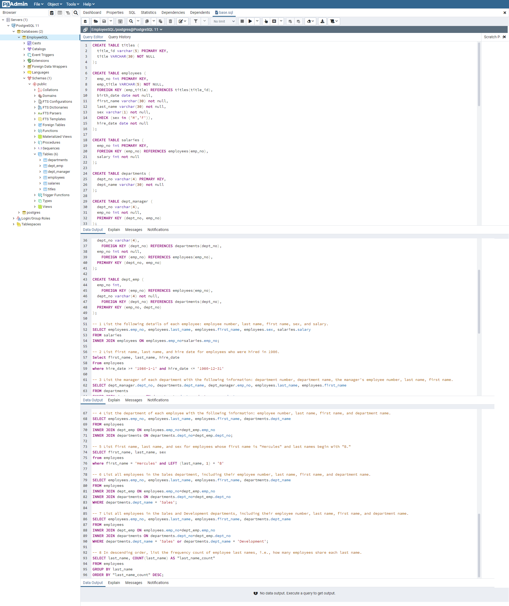

# Employee Database: A Mystery in Two Parts

#### Data Modeling

Inspect the CSVs and sketch out an ERD of the tables. Feel free to use a tool like ...

#### Data Engineering
#### Data Analysis

## Bonus (Optional)
## Epilogue

